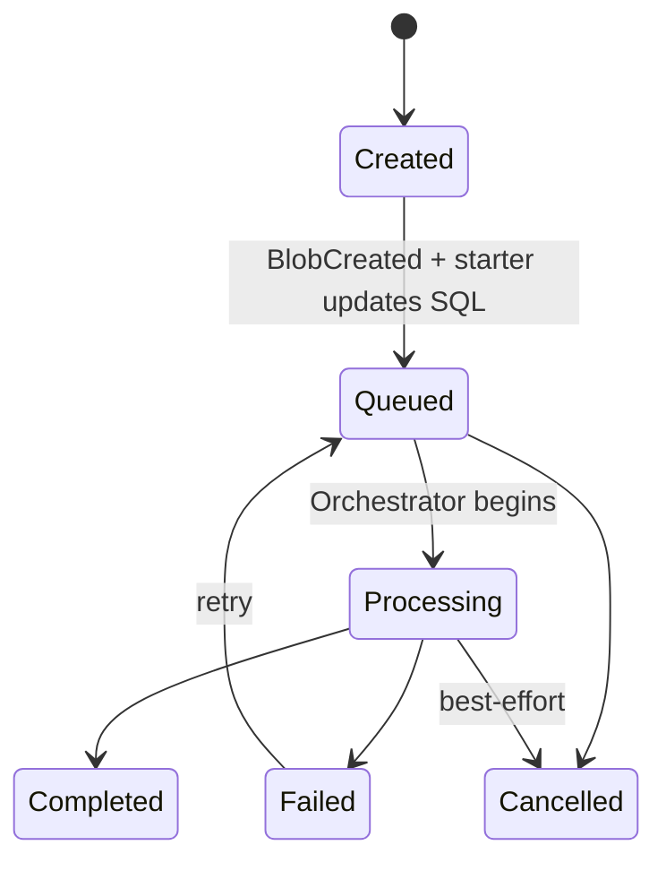

# Architecture

This document captures the end-to-end file-first processing pipeline and the main state transitions for uploaded files.

## Updated system architecture (file-first)

```mermaid
flowchart LR
  U[Browser / React SPA] --> API[.NET API]
  API --> SQL[(Azure SQL<br/>File metadata + status)]
  API -->|SAS Upload URL| U

  U -->|PUT PDF via SAS| BLOB[(Blob Storage<br/>incoming/)]
  BLOB -->|BlobCreated| EG[Event Grid System Topic]
  EG --> SB[(Service Bus Queue<br/>files or files-{devAlias})]

  SB --> START[Functions: SB Trigger "Starter"]
  START --> ORCH[Durable Orchestrator<br/>instanceId = fileId]

  ORCH --> PRE[Activity: External pre-check]
  ORCH --> SPLIT[Activity: iText split to 100pg chunks]
  ORCH --> TAG[Fan-out: Chunk tagger activities (LLM)]
  ORCH --> MERGE[Activity: iText merge chunks]
  ORCH --> POST[Activity: External post-check]
  ORCH --> FINAL[Activity: finalize status + metrics]

  ORCH --> BLOB
  ORCH --> SQL
```

### Why a "Starter" function?

Event Grid to Service Bus can deliver a CloudEvent payload. The starter function:

- Parses the CloudEvent
- Extracts blob path and derives `fileId`
- Updates SQL state to `Queued`
- Starts the durable orchestration for that `fileId` (idempotent)

## Upload + processing flow (sequence)

```mermaid
sequenceDiagram
  autonumber
  participant UI as React SPA
  participant API as .NET API
  participant DB as Azure SQL
  participant S as Blob Storage
  participant EG as Event Grid
  participant SB as Service Bus
  participant FS as Func Starter
  participant OR as Durable Orchestrator

  UI->>API: POST /files/initiate {originalFileName, size, contentType, uploadSessionId?}
  API->>DB: Insert File row (fileId, originalFileName, Status=Created)
  API->>UI: 200 {fileId, sasUploadUrl}

  UI->>S: PUT bytes to sasUploadUrl (incoming/.../fileId.pdf)
  S-->>EG: BlobCreated event
  EG->>SB: enqueue event payload (no code)

  SB->>FS: trigger (CloudEvent)
  FS->>DB: Status -> Queued, store input blob name
  FS->>OR: Start orchestration(instanceId=fileId)

  OR->>DB: Status -> Processing
  OR->>S: Read input; write temp chunks/tagged/output/reports
  OR->>DB: Status -> Completed/Failed + output pointers
```

## File status state machine


