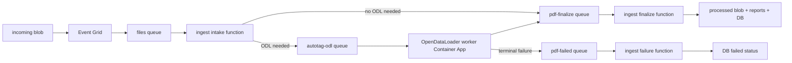

# Azure infrastructure

Use the environment-specific deploy scripts to provision Azure resources.

## Deploy (dev)

1. Log in to Azure:

```bash
az login
```

2. Export the SQL admin password and run the script:

```bash
export SQL_ADMIN_PASSWORD='your-strong-password'
./infrastructure/azure/scripts/deploy_dev.sh
```

## Deploy (test)

```bash
export SQL_ADMIN_PASSWORD='your-strong-password'
./infrastructure/azure/scripts/deploy_test.sh
```

## Deploy (prod)

```bash
export SQL_ADMIN_PASSWORD='your-strong-password'
./infrastructure/azure/scripts/deploy_prod.sh
```

## Notes

- The script expects Azure CLI to be installed and will fail fast if it is missing.
- The wrapper scripts set defaults for subscription, resource group, and environment for each target (`dev`, `test`, `prod`).

## Deploy function code (ingest)

The infra deployment provisions the Function App, but does not publish code to it.

1. Find the Function App name:

```bash
az functionapp list -g rg-readable-dev --query "[].name" -o tsv
```

2. Publish the function from this repo:

```bash
cd workers/function.ingest
func azure functionapp publish <FUNCTION_APP_NAME> --dotnet-isolated --nozip
```

## Deploy OpenDataLoader Worker Container App

The base Bicep deployment now provisions:

- an Azure Container Registry,
- a Container Apps environment,
- Service Bus queues for each ingest stage,
- and, once an image is supplied, the `opendataloader` worker Container App itself.

The queue-based ingest pipeline is:



Queue ownership:

- `files`: Event Grid upload events. Consumed by the ingest intake function.
- `autotag-odl`: OpenDataLoader autotag jobs. Consumed by the ODL worker Container App.
- `pdf-finalize`: staged PDFs ready for remediation/final upload. Consumed by the ingest finalize function.
- `pdf-failed`: terminal autotag failures. Consumed by the ingest failure function to mark the DB attempt/file failed.

For a first-time setup without an image yet, bootstrap the optional ACR and
Container Apps environment first:

```bash
export DEPLOY_OPEN_DATA_LOADER_INFRASTRUCTURE=true
./infrastructure/azure/scripts/deploy_dev.sh
```

After the base infra exists, build and push the worker image:

```bash
az acr login --name <ACR_NAME>
docker build -f workers/opendataloader.api/Dockerfile -t <ACR_LOGIN_SERVER>/opendataloader-api:<TAG> .
docker push <ACR_LOGIN_SERVER>/opendataloader-api:<TAG>
```

Then rerun the deploy script with the image reference:

```bash
export OPEN_DATA_LOADER_IMAGE='<ACR_LOGIN_SERVER>/opendataloader-api:<TAG>'
export DEPLOY_EVENTGRID_SUBSCRIPTION=false
./infrastructure/azure/scripts/deploy_dev.sh
```

The ODL worker has no public ingress. It reads `autotag-odl`, downloads the
source PDF from Blob Storage, runs `opendataloader-pdf`, writes the tagged PDF
and ODL report to storage, and sends a `pdf-finalize` message. On the final
configured delivery attempt, it sends a `pdf-failed` message instead of letting
the ODL job dead-letter without updating the database.

Get the worker name from deployment outputs:

```bash
az deployment group show \
  --resource-group <RESOURCE_GROUP> \
  --name <DEPLOYMENT_NAME> \
  --query "properties.outputs.openDataLoaderContainerAppName.value" \
  -o tsv
```

Inspect queue depth:

```bash
az servicebus queue show \
  --resource-group <RESOURCE_GROUP> \
  --namespace-name <SERVICE_BUS_NAMESPACE> \
  --name autotag-odl \
  --query "{active:countDetails.activeMessageCount, deadletter:countDetails.deadLetterMessageCount}"
```

Tail worker logs:

```bash
az containerapp logs show \
  --resource-group <RESOURCE_GROUP> \
  --name <OPEN_DATA_LOADER_CONTAINER_APP_NAME> \
  --follow
```

The worker scales from the `autotag-odl` queue. `openDataLoaderMaxReplicas`
caps global ODL concurrency, while `openDataLoaderMaxConcurrentConversions`
controls conversions per replica. Start conservatively with one conversion per
replica, then increase max replicas after observing CPU, memory, and conversion
latency.

Rollback is configuration-only: deploy without `OPEN_DATA_LOADER_IMAGE`, or set
the ingest autotag provider back to Adobe and scale the ODL worker down.

## Tail logs (no Application Insights)

```bash
az webapp log config -g rg-readable-dev -n <FUNCTION_APP_NAME> --application-logging filesystem --level information
az functionapp log tail -g rg-readable-dev -n <FUNCTION_APP_NAME>
```

You can also use the Function App "Log stream" blade in the Azure Portal.

## Trigger the pipeline

The Event Grid subscription is filtered to only fire when a `.pdf` is uploaded into the `incoming` container.

Upload a PDF:

```bash
az storage blob upload \
  --account-name <DATA_STORAGE_ACCOUNT_NAME> \
  --container-name incoming \
  --name sample.pdf \
  --file ./sample.pdf \
  --auth-mode login
```
